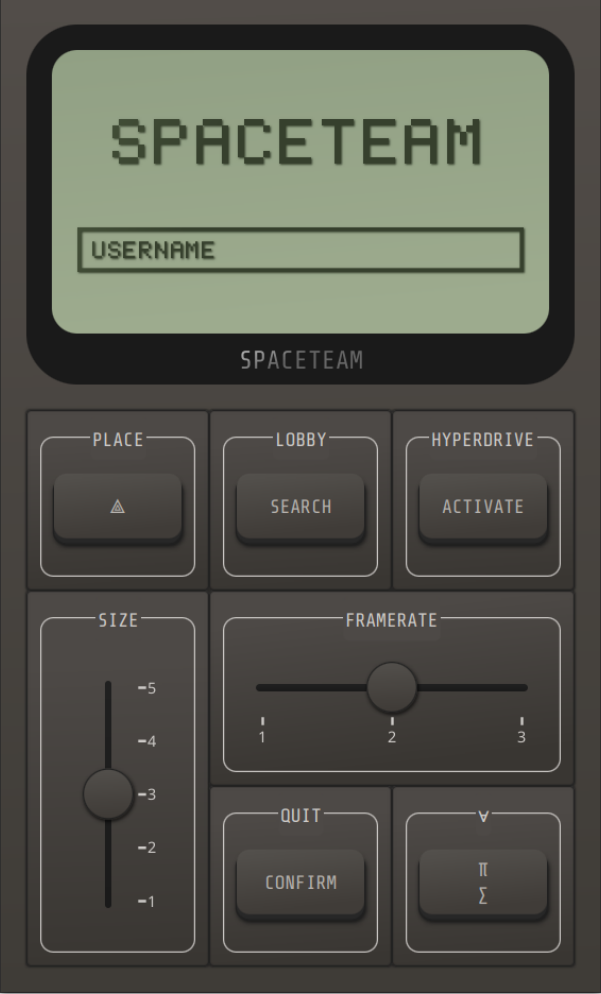
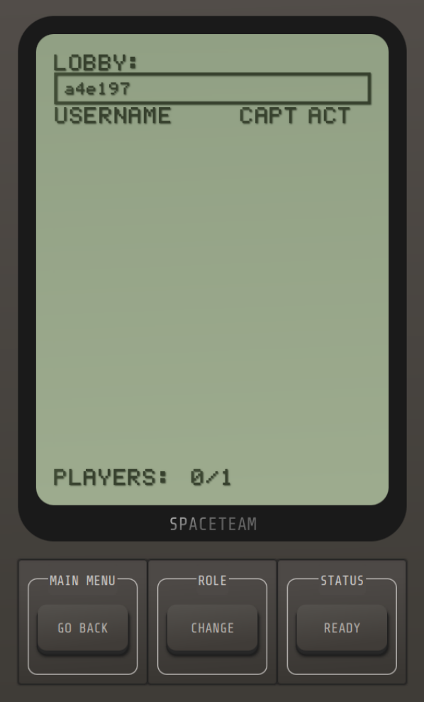
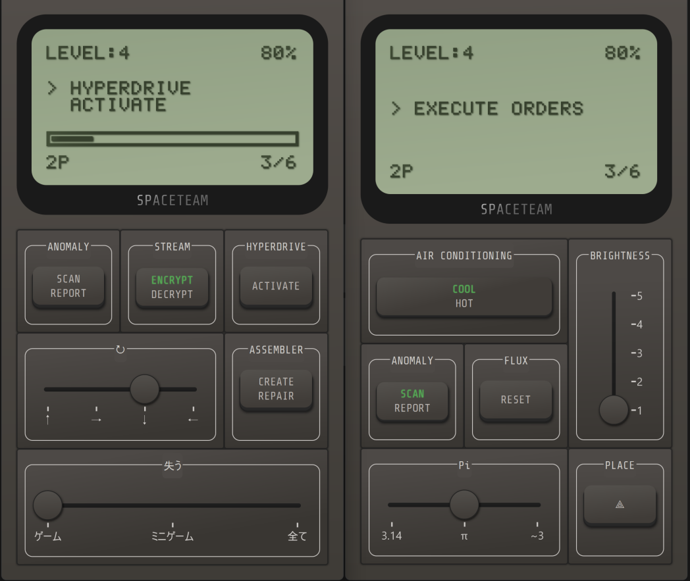

# Spaceteam Game
This project focuses on the development of a multiplayer game inspired by the video game *Spaceteam*. In this game, players work together to conduct a spaceship on a journey across the galaxy. Each player has a unique control panel displaying the ship's current state, with a randomized assortment of buttons and other controls labeled with technobabble, symbols, and hard-to-read words.\
During each level, players designated as captains receive random orders to activate specific controls, however, the actions often apply to another player's control panel. Each order is timed, and if not completed succesfully, the spaceship takes damage. If the damage sustained becomes too severe, the game ends.\
Players must communicate verbally, either in person or through online voice chat, to ensure the correct actions are performed.
Succesfully completing the required amount of orders within a level advances the team to the next level, where challenges get tougher. The objective of the game is to progress as far as possible.

Main menu             |  Lobby menu
:-------------------------:|:-------------------------:
  |  



## How to run the game
This project consists of two components:

### 1. Spaceteam (Main Application)
The core application for the Spaceteam game. It handles the game logic and interactions between players.\
There are two options for running the game: use the provided bundled JAR, or run the project using Gradle.
- Using the provided JAR:
    To start the game application, nagivate inside the ```spaceteam``` directory and run the command ```java -DmqttBrokerAddress=tcp://127.0.0.1:1883 -jar Spaceteam.jar```
    When using a remote broker, replace the loopback address ```127.0.0.1``` with the appropriate domain.
- Using Gradle
    To start the game application, navigate inside the ```spaceteam``` directory and run the command ```./gradlew run``` on Linux or ```.\gradlew.bat run``` on Windows.\
    To specify a remote broker address create a ```gradle.properties``` file following the example provided in the ```gradle.properties.template``` file, replacing the loopback address ```127.0.0.1``` with the appropriate domain.

### 2. EMQX (MQTT Broker)
Provides Docker configurations for the EMQX open-source MQTT broker, which is used by the Spaceteam application. The broker can run either locally or on a remote server.

To start the broker use the ```docker-compose up -d``` command.

If you run the broker on a remote server, some additional configurations may be required. For instance, if you're using NGINX as a reverse proxy, you’ll need to update your server configuration to access the dashboard. Here's an example of how to configure NGINX:

```nginx
server {
    server_name emqx.domain.com www.emqx.domain.com;
    listen 443 ssl;
    ssl_certificate /.../certificate.cer;
    ssl_certificate_key /.../private_key.key;
    location / {
        proxy_pass http://localhost:18083;
        proxy_set_header Host $host;
        proxy_set_header X-Real-IP $remote_addr;
    }
}
```
